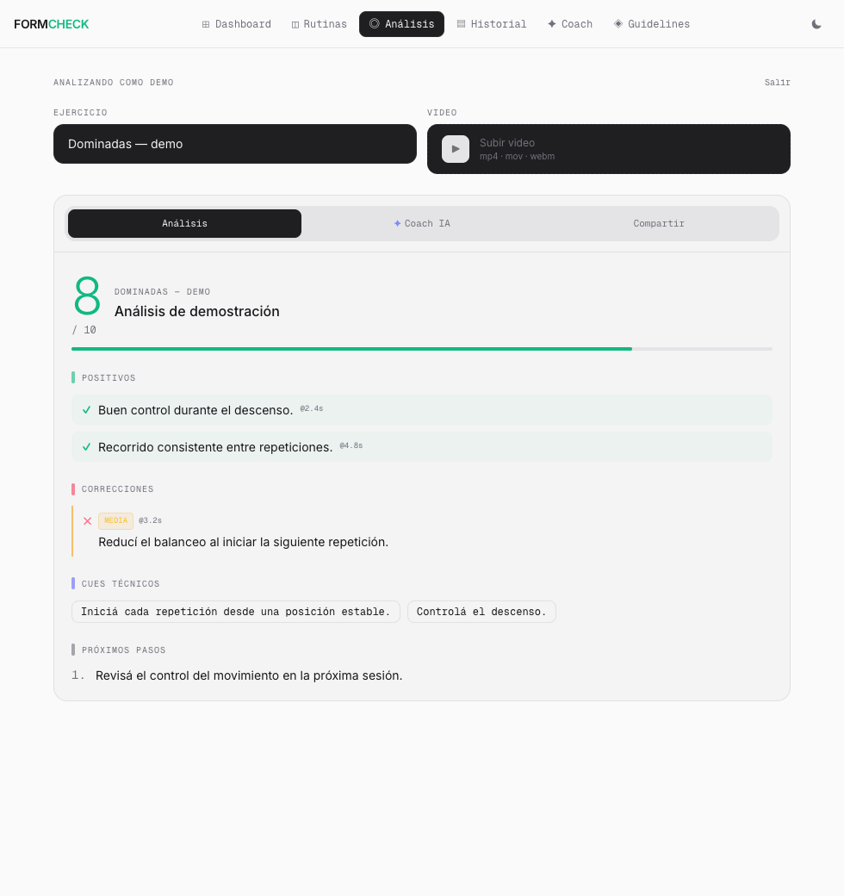

# AI Calisthenics Analyzer

A web application that uses multimodal AI to analyze calisthenics technique from video, providing biomechanical scoring, frame-level corrections, and an AI coaching chat — all in one interface.



*Actual interface populated with fictional analysis data for this preview. No personal training video or real assessment is shown.*

## What It Does

Upload a video of any calisthenics movement (muscle-up, pull-up, planche, etc.) and get:

- **Technique score** (1–10) with rigorous biomechanical criteria
- **Timestamped corrections** pinpointing exact moments where errors occur, with visual frame evidence
- **Positive highlights** with the specific muscles and joints performing well
- **Coaching cues** — short, actionable phrases to drill during practice
- **Second-pass verification** — after the main analysis, specific error frames are re-evaluated to confirm corrections
- **AI Coach chat** — conversational follow-up powered by Claude
- **Session history** — track progress across sessions, compare scores over time
- **Training planner** — build multi-week routines with weekly logging
- **Goal tracker** — set and monitor skill, strength, and endurance goals

## Tech Stack

| Layer | Technology |
|---|---|
| Framework | Next.js 14 (App Router) |
| Language | TypeScript |
| Styling | Tailwind CSS |
| AI — Video Analysis | Google Gemini (multimodal) |
| AI — Coach Chat | Anthropic Claude (`claude-sonnet-4-6`) |
| AI — Alternative | Kimi K2.5 (optional) |
| Database | Supabase (PostgreSQL) |
| Auth | Custom cookie-based session |

## How the Analysis Pipeline Works

1. **Frame extraction** — the browser extracts 8–16 frames from the uploaded video at evenly distributed timestamps
2. **Video upload to Gemini** — the full video is uploaded to Gemini Files API and processed as a multimodal input
3. **Structured analysis** — Gemini returns a JSON response with score, corrections, positives, cues, and a share summary; each item references an exact timestamp in the video
4. **Frame-level verification** — frames at the reported error timestamps are recaptured and sent to a second AI pass to confirm the corrections
5. **AI summary** — a concise 2–3 sentence summary is generated for historical comparison across sessions
6. **Session persistence** — everything is saved to Supabase: score, corrections, positives, AI summary, and raw frame data

## Local Setup

### Prerequisites

- Node.js 18+
- A Supabase project (free tier works)
- Google AI Studio API key (for Gemini)
- Anthropic API key (for Claude coach chat)

### 1. Install dependencies

```bash
npm install
```

### 2. Configure environment variables

Create a `.env.local` file in the project root:

```bash
# AI providers
ANTHROPIC_API_KEY=sk-ant-...
GOOGLE_API_KEY=AIza...

# Optional: Kimi K2.5
KIMI_API_KEY=...
KIMI_BASE_URL=https://api.moonshot.ai/v1
KIMI_MODEL=kimi-k2.5

# Supabase
NEXT_PUBLIC_SUPABASE_URL=https://xxxx.supabase.co
SUPABASE_SERVICE_ROLE_KEY=eyJhb...
```

### 3. Initialize the database

Run the SQL schema in your Supabase project's SQL Editor:

```
supabase/migrations/20260312000000_init_schema.sql
```

This creates tables for: `users`, `sessions`, `chats`, `routines`, `week_logs`, and `goals`.

### 4. Start the development server

```bash
npm run dev
```

Open [http://localhost:3000](http://localhost:3000).

## Project Structure

```
app/
  api/
    analyze/        ← video analysis pipeline (Gemini)
    verify/         ← second-pass frame verification
    chat/           ← AI coach chat (Claude)
    training/       ← routine CRUD + weekly logging
    goals/          ← goals CRUD
    history/        ← session history
    auth/           ← login / logout / me
  dashboard/        ← progress overview
  history/          ← session history list
  training/         ← routine planner + weekly log
  guidelines/       ← technique reference
components/
  AnalysisResult    ← score card, corrections, cues
  ChatPanel         ← AI coach conversation
  FrameStrip        ← extracted frame browser
  SharePanel        ← shareable summary generator
  ProgressChart     ← score evolution chart
lib/
  storage.ts        ← session persistence (Supabase)
  training.ts       ← routine logic
  chats.ts          ← chat history persistence
  goals.ts          ← goals persistence
  users.ts          ← auth helpers
  models.ts         ← AI model configuration
```

## Key Design Decisions

- **Frame extraction is done in the browser** via the Canvas API — no server-side video processing overhead
- **Gemini receives the full video**, not just frames, enabling temporal reasoning about movement phases
- **Corrections include `timeRef`** (exact second) and `frameDescription` (what the AI sees) — this forces the model to ground its feedback in specific visual evidence rather than generic advice
- **Supabase with service role key** is used server-side only; the key is never exposed to the client
- **No Supabase RLS** — authentication is handled via a custom session cookie; RLS can be added if migrating to Supabase Auth

## Scripts

```bash
npm run dev      # development server
npm run build    # production build
npm run start    # production server
npm run lint     # ESLint
```
